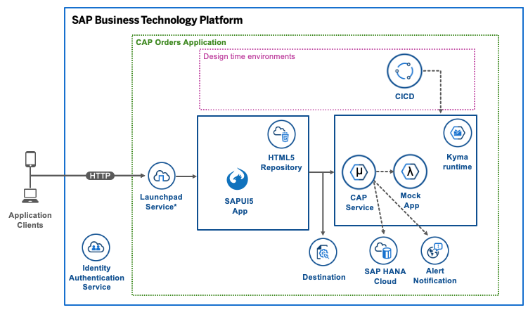

# DEV261 - Build Extensions with SAP BTP, Kyma Runtime

 

## Description

This repository contains the material for the SAP TechEd 2021 session called DEV261 - "Build Extensions with SAP BTP, Kyma Runtime".

[The video replay is now available.](https://www.youtube.com/watch?v=5MwJQzRvijM)

## Overview

This session introduces attendees to making use of the advantages that come along with Kubernetes in the context of their SAP BTP projects. SAP BTP, Kyma runtime is the fully managed Kubernetes runtime based on the open-source project "Kyma". This cloud-native solution allows the developers to extend SAP solutions with serverless Functions and combine them with containerized microservices. The offered functionality ensures smooth consumption of SAP and non-SAP applications, running workloads in a highly scalable environment, and building event- and API-based extensions.

During this session, you will learn how to make use of SAP BTP services in the context of a Kyma-based project.

This application will also make use of the services:

- [SAP Launchpad service](https://discovery-center.cloud.sap/serviceCatalog/launchpad-service)
- [SAP HANA Cloud](https://discovery-center.cloud.sap/serviceCatalog/sap-hana-cloud)
- [SAP Alert Notification](https://discovery-center.cloud.sap/serviceCatalog/alert-notification)
- [SAP HTML5 Application Repository](https://discovery-center.cloud.sap/serviceCatalog/html5-application-repository-service)

> ⚠ NOTE: Particularly the enablement of SAP BTP, Kyma runtime and instance creation of SAP HANA Cloud takes around 1 hour. Therefore, it is recommended that you finalize [Getting Started](exercises/ex0/) ahead of time.

The overall solution will finally look like this:

You will also see how to setup your continuous integration and delivery pipeline using "[SAP Continuous Integration and Delivery](https://discovery-center.cloud.sap/serviceCatalog/continuous-integration-&-delivery)" for deploying a CAP application.

## Requirements

To follow the exercises in this repository, you can also use a free SAP BTP trial account or you make use of the free tier inside your SAP BTP global account. Details are described on [SAP.com](https://www.sap.com/products/business-technology-platform/trial.html).

Furthermore, you need to have the following tools and frameworks installed on your computer:

- [kubectl](https://developers.sap.com/tutorials/cp-kyma-download-cli.html)
- [nodejs version 14.\*](https://nodejs.org/en/download/)
- [jq](https://stedolan.github.io/jq/) - for JSON processing in CLI
- [Docker Desktop](https://www.docker.com/) installed with a valid public account
  > ⚠ NOTE: Be aware of the terms of Docker for usage in enterprises. For details see [link](https://www.docker.com/blog/updating-product-subscriptions/)

> ⚠ NOTE: The various hands-on exercises uses [docker](https://www.docker.com/) and [Kubernetes](https://kubernetes.io/) extensively. A basic knowledge of these technologies will also be helpful.

- For MS Windows clients, it is recommended to use [PowerShell](https://www.microsoft.com/en-us/p/powershell/9mz1snwt0n5d)

## Exercises

- [Getting Started](exercises/ex0/)
  - [FORK AND CLONE REPO](exercises/ex0/README.md#fork-and-clone-the-repository)
  - [SAP BTP SUBACCOUNT CONFIGURATION](exercises/ex0/README.md#configure-subaccount-entitlements)
  - [SAP KYMA RUNTIME](exercises/ex0/README.md#kyma-runtime)
  - [SAP LAUNCHPAD SERVICES](exercises/ex0/README.md#launchpad-service)
  - [SAP CLOUD FOUNDRY CONFIGURATION](exercises/ex0/README.md#cloud-foundry)
  - [SAP CONTINUOUS INTEGRATION & DELIVERY SERVICE](exercises/ex0/README.md#continuous-integration--delivery)
  - [SAP HANA CLOUD](exercises/ex0/README.md#sap-hana-cloud)
- [Exercise 1 - CREATE THE XSUAA SERVICE INSTANCE](exercises/ex1/)
- [Exercise 2 - PREPARE APP FOR LOCAL USE (optional)](exercises/ex2/)
- [Exercise 3 - CONFIGURE THE SAP CICD SERVICE](exercises/ex3/)
  - [Exercise 3.1 - CREATE THE GITHUB CREDENTIAL](exercises/ex3#exercise-31---create-the-github-credential)
  - [Exercise 3.2 - CREATE THE DOCKER CREDENTIAL](exercises/ex3#exercise-32---create-the-docker-credential)
  - [Exercise 3.3 - CONFIGURE KUBECONFIG](exercises/ex3#exercise-33---configure-kubeconfig)
  - [Exercise 3.4 - ADD THE GITHUB REPOSITORY](exercises/ex3#exercise-34---add-the-github-repository)
  - [Exercise 3.5 - CREATE THE CICD JOBS](exercises/ex3#exercise-35---create-the-cicd-jobs)
    - [Exercise 3.5.1 - CAP-ORDERS-SERVICE](exercises/ex3#exercise-351---cap-orders-service)
    - [Exercise 3.5.2 - ORDERS-HTML5-DEPLOYER - OPTIONAL](exercises/ex3#exercise-352---orders-html5-deployer---optional)
    - [Exercise 3.5.3 - ORDERS-DB-DEPLOYER- OPTIONAL](exercises/ex3#exercise-353---orders-db-deployer---optional)
    - [Exercise 3.5.4 - CAPUITOOLS - OPTIONAL](exercises/ex3#exercise-354---capuitools---optional)
- [Exercise 4 - GENERATE TOOLS BASE IMAGE](exercises/ex4/)
- [Exercise 5 - GENERATE THE CAP DATABASE](exercises/ex5/)
  - [Exercise 5.1 - DEPLOYMENT OPTION 1 - SAP CICD](exercises/ex5#exercise-51---deployment-option-1---sap-cicd)
  - [Exercise 5.2 - DEPLOYMENT OPTION 2 - kubectl](exercises/ex5#exercise-52---deployment-option-2---kubectl)
  - [Exercise 5.3 - DEPLOYMENT OPTION 3 - Helm](exercises/ex5#exercise-53---deployment-option-3---helm)
- [Exercise 6 - DEPLOY HTML5 APP AND LAUNCHPAD CONFIG](exercises/ex6/)
  - [Exercise 6.1 - DEPLOYMENT OPTION 1 - SAP CICD](exercises/ex6#exercise-61---deployment-option-1---cicd-service)
  - [Exercise 6.2 - DEPLOYMENT OPTION 2 - kubectl](exercises/ex6#exercise-62---deployment-option-2---kubectl)
  - [Exercise 6.3 - DEPLOYMENT OPTION 3 - Helm](exercises/ex6#exercise-63---deployment-option-3---helm)
- [Exercise 7 - BUILD AND DEPLOY CAP SERVICE](exercises/ex7/)
  - [Exercise 7.1 - DEPLOYMENT OPTION 1 - SAP CICD](exercises/ex7#exercise-71---deployment-option-1---cicd-service)
  - [Exercise 7.2 - DEPLOYMENT OPTION 2 - kubectl](exercises/ex7#exercise-72---deployment-option-2---kubectl)
  - [Exercise 7.3 - DEPLOYMENT OPTION 3 - Helm](exercises/ex7#exercise-73---deployment-option-3---helm)
- [Exercise 8 - CONFIGURE LAUNCHPAD](exercises/ex8/)
- [Exercise 9 - REQUIRE OAUTH FOR THE ACTION](exercises/ex9/)
- [Exercise 10 - SAP ALERT NOTIFICATION CONFIGURATION](exercises/ex10/)
- [Exercise 11 - MOCK APPLICATION](exercises/ex11/)

## How to obtain support

Support for the content in this repository is available during the actual time of the online session for which this content has been designed. Otherwise, you may request support via the [Issues](../../issues) tab.

## Contributing

If you wish to contribute code, offer fixes or improvements, please send a pull request. Due to legal reasons, contributors will be asked to accept a DCO when they create the first pull request to this project. This happens in an automated fashion during the submission process. SAP uses [the standard DCO text of the Linux Foundation](https://developercertificate.org/).

## Code of Conduct

Please note, that we have a [code of conduct](https://github.com/SAP-samples/.github/blob/main/CODE_OF_CONDUCT.md), please follow it in all your interactions with the project.

## License

Copyright (c) 2021 SAP SE or an SAP affiliate company. All rights reserved. This project is licensed under the Apache Software License, version 2.0 except as noted otherwise in the [LICENSE](LICENSES/Apache-2.0.txt) file.
