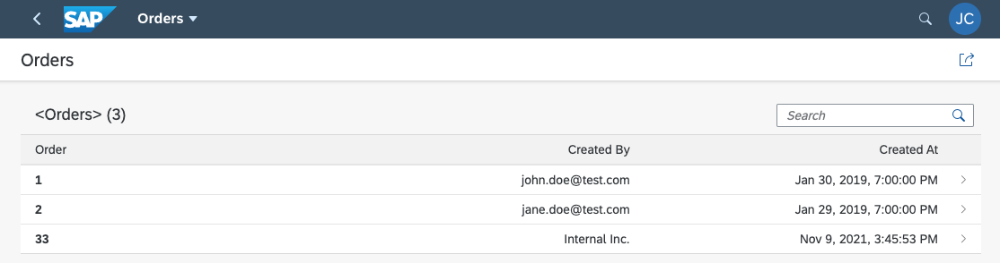

# Exercise 11 - MOCK APPLICATION

## Goal 🎯

In this exercise we will add a Mock application namely a Kyma function into the Kyma cluster to insert order data into the SAP HANA Database whenever a **submitexternalorder** is called using the internal network of the Kyma cluster.

## Setup of the Mock Application

In the file **srv/orders-service.js** you find the definition of a CDS Action called **submitexternalorder**. The implemtation of this Action expects to receive an **orderNo** found in the body of a POST request. Using the received **orderNo** a call will be made to the Kyma function **order-mock** using the Kyma cluster's internal network. The function provides a random set of values which are then inserted into the SAP HANA Cloud database.

To deploy the Kyma function apply the **order-mock** function deployment

```shell
kubectl -n cap apply -f ./resources/functionmock/deployment.yaml
```


## Local Call of the Mock Application

To be able to test locally apply the **order-mock** API rule deployment via:

```shell
kubectl -n cap apply -f ./resources/functionmock/apirule.yaml
```

Now call the mock function using:

- In shell

  ```shell
  curl -X POST https://order-mock.<cluster url>/orders -H 'Content-Type: application/json' -d '{"orderNo": 123123}'
  ```

- In Powershell

  ```powershell
  curl.exe '-X' 'POST' 'https://order-mock.<cluster url>/orders' '-H' 'Content-Type: application/json' '-d' '{\"orderNo\": 123123}'
  ```

The result of this call should be similar to:

```json
{
  "OrderNo": "123123",
  "createdBy": "Internal Inc.",
  "buyer": "The Buyer Co.",
  "currency": { "code": "EUR" },
  "Items": [
    {
      "product_ID": "25820",
      "quantity": 4,
      "title": "structure",
      "price": 10
    }
  ]
}
```

If you get the message "no healthy upstream", try again after a minute.

After testing delete the API rule via:

```shell
kubectl -n cap delete -f ./resources/functionmock/apirule.yaml
```

## Call via SUBMITORDER Action

Using the **access_token** obtained in [exercise 9](../ex9/README.md)  we call the **external/submitorder** endpoint again

- In shell

  ```shell
  curl -X POST https://cap-orders-service.<cluster url>/external/submitorder -H 'Content-Type: application/json' -H 'Authorization: Bearer <access_token>' -d '{"orderNo": 123123}'
  ```

- In PowerShell

  ```powershell
  curl.exe '-X' 'POST' 'https://cap-orders-service.<cluster url>/external/submitorder' '-H' 'Content-Type: application/json' '-H' 'Authorization: Bearer <access_token>' '-d' '{\"orderNo\": 123123}'
  ```

This call should now succeed with a response similar to

```json
{
  "result": [
    {
      "affectedRows": 1,
      "values": [
        "33",
        "Internal Inc.",
        "The Buyer Co.",
        "119bb000-582c-4bd7-90b7-1b1fef08dd38",
        "2021-11-09T20:45:53.443Z",
        "2021-11-09T20:45:53.443Z",
        "anonymous",
        "EUR"
      ]
    },
    {
      "affectedRows": 1,
      "values": [
        "970264",
        7,
        "road",
        14,
        "119bb000-582c-4bd7-90b7-1b1fef08dd38",
        "f2fac900-ba85-4aad-9448-1fe55ddccc93"
      ]
    }
  ]
}
```

You now find another entry in the Orders application configured to be shown in the SAP Launchpad



## Summary

🚀 Congratulations - You successfully completed the setup of the mock up and you made it through this tutorial! 🚀

[◀ Previous exercise](../ex10/README.md) | [🔼 Overview](../../README.md)
