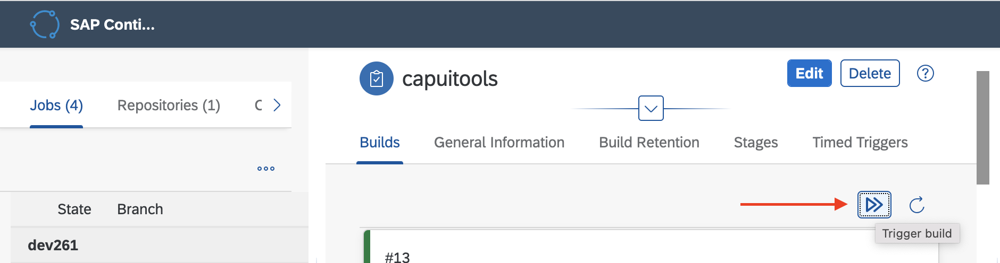

# Exercise 3 - CONFIGURE THE SAP CICD SERVICE

## Goal 🎯

SAP Continuous Integration and Delivery (SAP CICD) lets you configure and run predefined continuous integration and delivery (CI/CD) pipelines that automatically test, build, and deploy your code changes to speed up your development and delivery cycles. SAP CICD supports a number of different use cases including the creation of pipelines used for the development of container-based applications.

This exercise will provide the necessary steps to configure and utilize a container-based applications pipeline which will deploy the CAP application into the Kyma runtime.

## Open the SAP CICD service

- Within subaccount choose **Instances and Subscriptions**
- Under Applications choose **Continuous Integration & Delivery**

## Exercise 3.1 - CREATE THE GITHUB CREDENTIAL

This process will only be required if your GitHub repo is **not public**. 

> ⚠ NOTE: If you forked this repo into your personal GitHub account, it most likely isn't public and will say `private` at the top left.

The process will include the creation of a **Personal access token** which is used as a credential to pull the code from your repo.

- Within your Forked repository at the top right choose **your avatar -> Settings**
- Choose **Developer settings**
- Choose **Personal access tokens**
- Choose **Generate new token**
- Provide the name **sapcicd**
- Choose the repo scope together with its subscopes
- Choose Generate token
- Copy the token value which is only shown once
- Open the SAP CICD service and choose the option **Credentials**
- Choose the plus sign to add an entry
- Provide the name **gitcred**
- Change the type to **Basic Authentication**
- Provide your git username as **Username**
- Provide the personal access token as the **Password**
- Choose **Create**

## Exercise 3.2 - CREATE THE DOCKER CREDENTIAL

The SAP CICD service will publish a new container image each time a job is triggered. This process requires access to a container repository via an access token. In this case we use Docker Hub, as repository for the newly built container image.

This step details the process of the creation of the access token used to perform this process.

- Log into your [Docker Hub](https://hub.docker.com/) account
- On the right hand top choose **your username -> Account Settings**
- Choose **Security -> New Access Token**
- Create a token with full access
- Copy the value into the json below replacing `{token}`
- Replace the `{docker-id}`

    ```json
    {
      "auths": {
        "https://index.docker.io/v1/": {
          "username": "{docker-id}",
          "password": "{token}"
        }
      }
    }
    ```

- Open the SAP CICD service and choose the option **Credentials**
- Choose the plus sign to add an entry
- Provide the name **dockercred**
- Change the type to **Secret Text**
- Copy the JSON structure as the **Secret**
- Choose **Create**

## Exercise 3.3 - CONFIGURE KUBECONFIG

To apply the configurations to the Kyma cluster we will need to authenticate to the Kyma cluster using a *kubeconfig*. A kubeconfig can be generated using a normal user which has an expiration time or a service account which does not. A *service account* is configured based on the APIs and their associated verbs available within the Kyma cluster. This service account can then be used to provide a non expiring kubeconfig which will be used by the SAP CICD service to apply the updated container images and associated kubernetes resources.

- Create the service account by following the tutorial: [Create a Kyma service account](https://developers.sap.com/tutorials/kyma-create-service-account.html)
- Open the SAP CICD service and choose the tab **Credentials**
- Choose the plus sign to add an entry
- Provide the name **kymacred**
- Change the type to **Secret Text**
- Copy the contents of the **tutorial-kubeconfig.yaml** into the value of the **Secret**
- Choose **Create**

## Exercise 3.4 - ADD THE GITHUB REPOSITORY

This step details the process of adding the GitHub repository container the code used to build the container images. Make sure to use your forked repository as the source.

- Open the SAP CICD service and choose the tab **Repositories**
- Choose the plus sign to add an entry
- Provide the name **dev261**
- Provide the url to your forked repo as the **Clone URL**
- If you defined a credential for your repo add it as the **Credentials** value
- Leave the rest of the values with their defaults and choose **Add**

After the creation
- Choose **Webhook Data** at the top of the just-created entry
- There will be a link called `dev261` on the dialog which will navigate to **Settings -> Hooks** of the desigated repo
- Choose **Add webhook**
- Copy the values `Payload URL` and `Secret` from the pop-up within the SAP CICD page, paste it into the `Add Webhook` screen, and adjust the **Content type**
- Choose **Add webhook**

## Exercise 3.5 - CREATE THE CICD JOBS

In this step we will configure the jobs to build each piece of the application. The SAP CICD service support the use of kubectl as well as helm. In the example we will configure jobs using helm. Add a Job for each microservice.

> ⚠ NOTE: The SAP Trial and Free tier are limited to two job configurations and one parallel build. For the exercise the creation of the job `cap-orders-service` is mandatory. The kubectl or helm commands can be used to deploy the other resources.

> ⚠ NOTE: At this point of the tutorial, the **most of the CICD jobs will fail**. The following steps will describe how to create and configure the jobs. In later exercises, you will make changes to your forked GitHub repository and once you commit these later changes, the jobs will run successfully.

### Exercise 3.5.1 - CAP-ORDERS-SERVICE

- Open the SAP CICD service and choose the tab **Jobs**
- Choose the plus sign to add an entry
- Provide the values:
  - General Information
    - Job Name: **cap-orders-service**
    - Repository: **dev261**
    - Branch: **main**
    - Pipeline: **Container-Base Applications**
  - Stages
    - Container Registry URL: **<https://index.docker.io>**
    - Container Image Name: **\<docker id>/cap-orders-service**
    - Container Image Tag: **latest**
    - Container Registry Credentials: **dockercred**
  - Build
    - Container File Path: **resources/service/Dockerfile**
  - Release
    - Kubernetes Credentials: **kymacred**
    - Namespace: **cap**
    - Deploy Tool: **helm3**
    - Chart Path: **resources/service/helm/cap-orders-service**
    - Deployment Name: **cap-orders-service**
    - Helm Values: **resources/service/helm/cap-orders-service/values.yaml**
    - Force Resource Updates: **false**

Choose `Create`.

### Exercise 3.5.2 - ORDERS-HTML5-DEPLOYER - OPTIONAL

> Creating this CICD job is optional and the required setup can be performed alternatively. The instructions are provided in the later section.

- Open the SAP CICD service and choose the tab **Jobs**
- Choose the plus sign to add an entry
- Provide the values:
  - General Information
    - Job Name: **orders-html5-deployer**
    - Repository: **dev261**
    - Branch: **main**
    - Pipeline: **Container-Base Applications**
  - Stages
    - Container Registry URL: **<https://index.docker.io>**
    - Container Image Name: **\<docker id>/orders-html5-deployer**
    - Container Image Tag: **latest**
    - Container Registry Credentials: **dockercred**
  - Build
    - Container File Path: **resources/html5/Dockerfile**
  - Release
    - Kubernetes Credentials: **kymacred**
    - Namespace: **cap**
    - Deploy Tool: **helm3**
    - Chart Path: **resources/html5/helm/orders-html5-deployer**
    - Deployment Name: **orders-html5-deployer**
    - Helm Values: **resources/html5/helm/orders-html5-deployer/values.yaml**
    - Force Resource Updates: **true**

### Exercise 3.5.3 - ORDERS-DB-DEPLOYER - OPTIONAL

> Creating this CICD job is optional and the required setup can be performed alternatively. The instructions are provided in the later section.

- Open the SAP CICD service and choose the tab **Jobs**
- Choose the plus sign to add an entry
- Provide the values:
  - General Information
    - Job Name: **orders-db-deployer**
    - Repository: **dev261**
    - Branch: **main**
    - Pipeline: **Container-Base Applications**
  - Stages
    - Container Registry URL: **<https://index.docker.io>**
    - Container Image Name: **\<docker id>/orders-db-deployer**
    - Container Image Tag: **latest**
    - Container Registry Credentials: **dockercred**
  - Build
    - Container File Path: **resources/db/Dockerfile**
  - Release
    - Kubernetes Credentials: **kymacred**
    - Namespace: **cap**
    - Deploy Tool: **helm3**
    - Chart Path: **resources/db/helm/orders-db-deployer**
    - Deployment Name: **orders-db-deployer**
    - Helm Values: **resources/db/helm/orders-db-deployer/values.yaml**
    - Force Resource Updates: **true**

### Exercise 3.5.4 - CAPUITOOLS - OPTIONAL

> Creating this CICD job is optional and the required setup can be performed alternatively. The instructions are provided in the later section.

- Open the SAP CICD service and choose the tab **Jobs**
- Choose the plus sign to add an entry
- Provide the values:

  - General Information
    - Job Name: **capuitools**
    - Repository: **dev261**
    - Branch: **main**
    - Pipeline: **Container-Base Applications**
  - Stages
    - Container Registry URL: **<https://index.docker.io>**
    - Container Image Name: **\<docker id>/capui5tools**
    - Container Image Tag: **latest**
    - Container Registry Credentials: **dockercred**
  - Build
    - Container File Path: **resources/capui5tools/Dockerfile**
  - Trigger the capui5tools Job to build the image and push it to to the docker repository.
    

## Summary

🎉 Congratulations - You've now completed the configuration of the SAP Continuous Integration and Delivery Service.

Continue to [Exercise 4 - GENERATE TOOLS BASE IMAGE](../ex4/README.md)

[◀ Previous exercise](../ex2/README.md) | [🔼 Overview](../../README.md) | [Next exercise ▶](../ex4/README.md)
